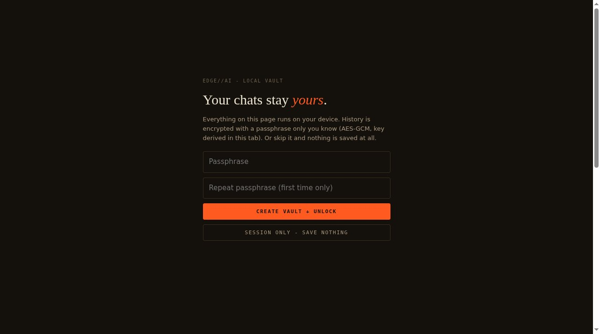

# EDGE//AI - on-device inference for any phone

Run real AI models entirely in the browser, on the device in your hand.
No backend, no account, no analytics. On-device is the default;
Gemini is an optional bring-your-own-key escape hatch.

Live: https://aeiouvcode.github.io/edge-ai/

## What it does

- **Device probe** - reads WebGPU / WebNN / WASM / RAM / storage and tells you
  honestly what this specific device can run well, slowly, or not at all.
- **Model shelf** - phone-sized models across task types:
  - Chat: SmolLM2 135M / 360M, Qwen2.5 0.5B / 1.5B (Instruct, ONNX, q4)
  - Speech to text: Whisper tiny (multilingual), Whisper base (English)
  - Translation: EN to Hindi / Spanish / French / German (OPUS-MT)
  - Embeddings: all-MiniLM-L6-v2 (semantic similarity)
  - Vision: MobileNetV4 image classification
  - Sentiment: DistilBERT SST-2
  - Voice: Kokoro 82M text-to-speech (experimental)
- **Compatibility preflight** - inspects a public Hugging Face repo before downloading weights: task, config/tokenizer, ONNX packaging, gated/remote-code flags, listed size and a conservative per-device memory budget. FAIL keeps Load disabled.
- **Workbench** - streaming chat, mic transcription, translation,
  similarity, photo classification, sentiment, speech synthesis.
  Everything after the one-time model download runs 100% offline.
- **Encrypted history** - optional passphrase vault (PBKDF2 -> AES-GCM,
  derived in-tab). Session-only mode saves nothing.
- **Optional cloud** - connect a Google AI Studio key to reach Gemini through
  Google's official API. Every send needs a preview; emails, phone numbers and
  protected terms are swapped for stand-ins before the prompt leaves and are
  restored locally. A self-hosted NVIDIA NIM on localhost is also supported.
- **Stop anytime** - on-device replies can be stopped mid-stream.
- **Offline shell** - a service worker caches the app + engine library;
  models live in the browser cache via Transformers.js. Load a model,
  flip to airplane mode, keep going.

## The honest edge

- Engine: [Transformers.js](https://huggingface.co/docs/transformers.js) + ONNX Runtime Web.
  WebGPU when the device has it, single-threaded WASM everywhere else.
- WebGPU: Chrome/Edge 113+, Android Chrome, iOS 26+ Safari. Older iOS: WASM fallback.
- What cannot run on a phone: GPT-4-class models, most >3B models, image/video
  generation on mid-range hardware, gated models. The app's Truth page says this
  to the user's face.

## Security

See [SECURITY.md](SECURITY.md): every network destination, the hash-locked
engine and vendored runtime, the page policy, and the known limits.

## Files

- `index.html` - the entire app (markup, styles, logic)
- `sw.js` - offline shell service worker
- `vendor/` - ONNX Runtime WebAssembly, byte-identical to the npm release (Transformers.js loads hash-locked from jsDelivr)

No build step. No secrets. Serve statically and open on a phone.
